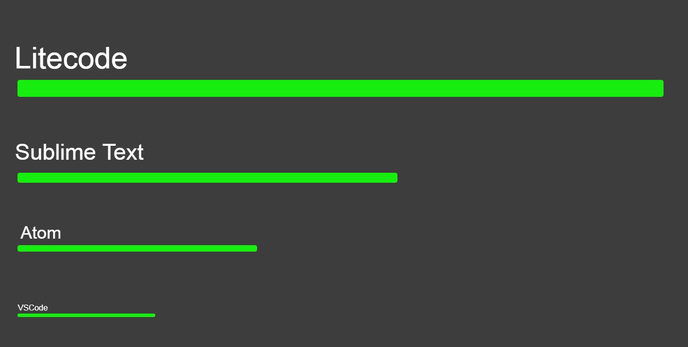

# Litecode

<h1>About Litecode</h1>

Litecode is a lightweight code editor (hence the name).

Lorem ipsum..

<h1>Installation</h1>

Lorem ipsum..

<h1>Why use us?</h1>

Litecode provides very fast performance as it uses C++ and OpenGL.

<h1>FAQ</h1>
<h3>When are you releasing:</h3>

Lorem ipsum..

